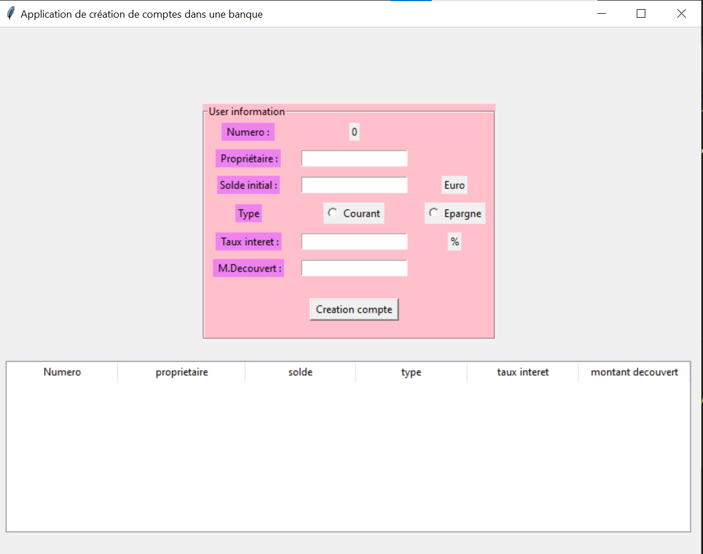

# Bank_Account_Management_System
The Bank Account Management System is a simple Tkinter-based application that allows users to create and manage bank accounts.

Users can input information such as the account owner's name, initial balance, account type (checking or savings), interest rate, and overdraft amount. The user interface provides an interactive experience, with radio buttons to select the account type and entry fields for data input. The entered information is displayed in a table, and each account's details are also saved to individual JSON files. The application provides basic functionalities for creating accounts and visualizing account details.

